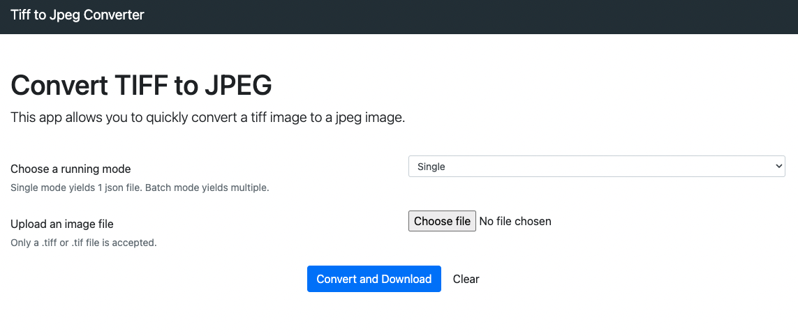
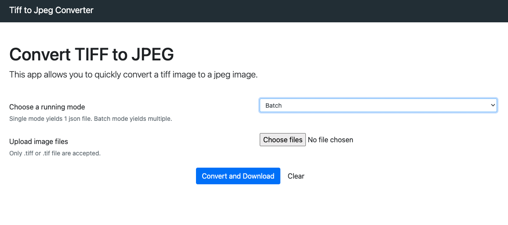

# TIFF to JPEG converter

Super simple web app to convert one or more tiff files to jpeg.

## Why?
Sometimes corporate companies expect you to do the work but they don't provide you with the tools.

Imagine having to download 150mb+ tiff files from a network drive over VPN and having to convert them to jpg, one at a time, using an online converter full of ads and file size limits, just to be able to use them in PowerPoint without Windows whining about it.

Solution? BYO online converter without file size limits and ads + batch mode.

## Single mode
Upload a single tiff file and receive a single converted jpeg file.


## Batch mode
Upload multiple tiff files and receive a zip file containing converted jpeg files.


## Run with Docker
```sh
docker build . -t tifftojpeg && docker run tifftojpeg
```

### Credits
Based on https://github.com/kckaiwei/tifftojpeg
